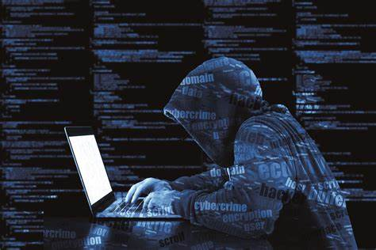

## The Sword and Shield of Sofware Engineering

 
## So many scams!
Using the internet and browsing through many unknown sites is not only dangerous but ignorant. There are many malicious sites out there that look innocent but may prompt you to download malicious software which can steal important information or destroy your computer. Today many elderly and children get attacked by these sites mostly because they bait and fish them using desirable things like “free iPhone” or “10000 Fortnite v bucks”. Alternatively, many people also fall for the “threat scams” where they would receive a message saying that their device is infected or they placed an order when they didn't. This could lead people to call these scammers and then let these scammers control their desktops resulting in them taking control.

## The Cyber Battlefield
Another type of common attack is infiltration which is done by hackers or foreign intelligence. For example, there are many news headlines where Russia or China are caught trying to spy on and steal information. So it is important for a country to have people who can defend or fight back against these attacks. Some of these attacks can lead to many people losing valuable and necessary things such as energy. This could result in a country paying a huge ransom to get its software back. 

## Many Many Jobs
I've always found this cyber news interesting and it made me want to pursue cybersecurity. Cybersecurity is one of the most in-demand jobs in software engineering. It is an important job that will always be exciting. Things are continuously changing and the battlefield is continuously evolving so there will always be a new challenges. It is also an important job and when used correctly you can be an important member in protecting people from those who wish to harm others.

## My path in Cybersecurity
In the future, I hope to get into this field but I also want to prepare for it. I am currently in Grey Hats and I want to gain skills that I can use to fight against hackers and create secure software so that it is safe. There are still many things I need to learn so I hope to get an entry-level job that is beginner friendly then I can work my way up to develop software. I am not sure what company I would like to join but this is definitely the sector I would like to be in.
