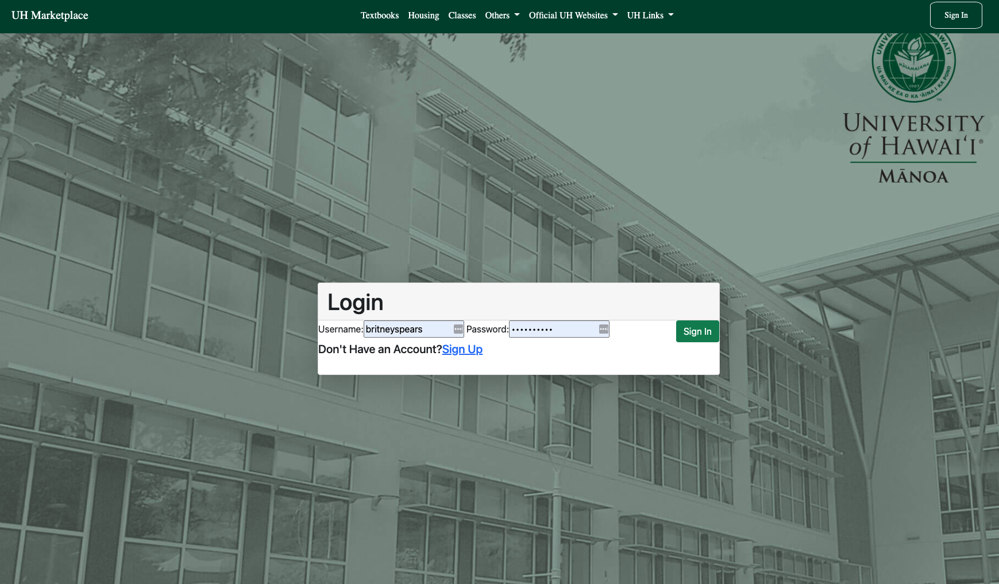
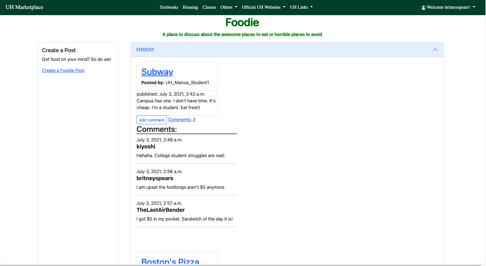

<h2> Aloha! Welcome to Manoa Trade Your Stuff </h2>
For my ICS 314 class, our final project was to create a website that would benefit the UH Manoa community. We had to form a group of four and we decided to create a webpage called Manoa Trade Your Stuff. The purpose of this webpage is to allow UH Manoa students to be able to auction the items that they would like to sell. The buyer will then make an offer then meet in person at the university. It is inspired by Craigslist which is an auction site where people can sell their items or looks for gigs. 

<h2> Login Page </h2>
They will have two options when they land on our webpage. The first is a sign-in page where if they are already an existing member they can log in. The other is a register account page where new users can create an account by entering their basic information such as name, email, student ID, phone number, etc. Once they sign in they will have access to the navbar where they can start using our site.

<h2> Profile </h2>
The user profile page is a personalized page that displays important information about a user, such as their student ID, name, email, phone number, and position. Users can easily edit their profile by clicking the “Edit Profile” button, which allows them to update their information as needed. The profile page displays the user’s recent sales and purchases, giving them a quick and easy way to track their activity. The page includes an “About” section, where users can introduce themselves and provide additional information about their interests, hobbies, or other relevant details. This section provides a great opportunity for users to share more about themselves with their peers and build stronger connections within the community.

<h2> Categories Page </h2>
The categories page is a hub that organizes various items for sale into different categories, making it easy for users to browse and find what they’re looking for. The page is divided into several categories, such as books, clothing and accessories, and electronics, each with its own sub-page. When users upload an item for sale, they can assign it to a specific category and provide all necessary details, such as the price and information about the item. This information is then displayed on the specific category page, allowing other users to easily browse and potentially purchase the item.

<h2> Item List Page </h2>
The item list page serves as a hub for users to browse and search for items they are interested in. It is linked to the categories page, allowing users to easily filter and navigate to specific types of items. Upon selecting a category, the page displays a list of relevant items with key information such as the seller’s details, pricing, and any other relevant details. This makes it easy for users to quickly find the items they are looking for and make informed purchase decisions.

 Notify Admin Page </h2>
The notify admin page is a page where users can issue complaints. There are two components that need to be filled out. First, the user must enter the users that were involved in the incident. Secondly, the user must describe the whole situation in detail so that the admin can fully understand what the problem is and the best course of action to resolve the issue. After the user inputs all these components they enter a button that will submit it and will send it to the admin for inspection.
<hr

