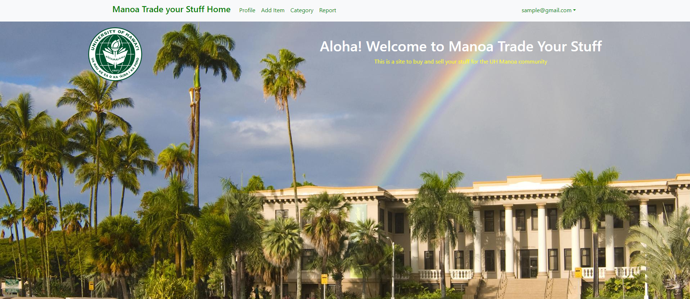
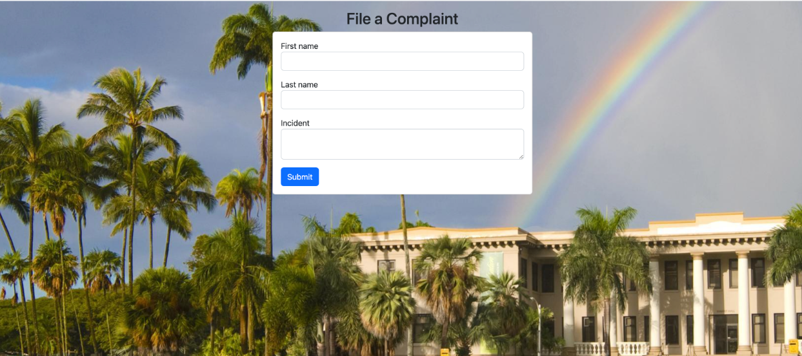

<h2> Aloha! Welcome to Manoa Trade Your Stuff </h2>
For my ICS 314 class, our final project was to create a website that would benefit the UH Manoa community. We had to form a group of four and we decided to create a webpage called Manoa Trade Your Stuff. The purpose of this webpage is to allow UH Manoa students to be able to auction the items that they would like to sell. The buyer will then make an offer then meet in person at the university. It is inspired by Craigslist which is an auction site where people can sell their items or looks for gigs. Below are a few examples of what our website looks like.

<h2> Landing Page </h2>
When users land on our webpage they will be greeted with a beautiful landing page of our university. They will have two options when they land on our webpage. The first is a sign-in page where if they are already an existing member they can log in. The other is a register account page where new users can create an account by entering their basic information such as name, email, student ID, phone number, etc. Once they sign in they will have access to the navbar where they can start using our site.

 
<h2> My Contribution: Notify Admin Page </h2>
My contribution was creating the The notify admin page which is where users can issue complaints. There are two components that need to be filled out. First, the user must enter the users that were involved in the incident. Secondly, the user must describe the whole situation in detail so that the admin can fully understand what the problem is and the best course of action to resolve the issue. After the user inputs all these components they enter a button that will submit it and will send it to the admin for inspection.
 

<h2> All in all </h2>
I enjoyed working on this project and I am grateful for the opportunity to be part of such a great team. I enjoyed seeing the outcome of our efforts and utilizing the various tools we learned throughout this semester, such as Meteor, Bootstrap, React, Javascript, and HTML/CSS. I am happy with how our site ended up looking. This is something that would not have been possible five months ago and it's hard to believe that we were able to create an actual functioning website. I am not sure if I will be building sites or using any of my web development skills in the future but it's a nice skill to have.
 
Take a look at our repo:  <a href="https://manoa-trade-your-stuff.github.io/">Team repo</a>
 
Take a look at our site: <a href="https://manoatradeyourstuff.site/">Manoa Trade Your Site</a>
