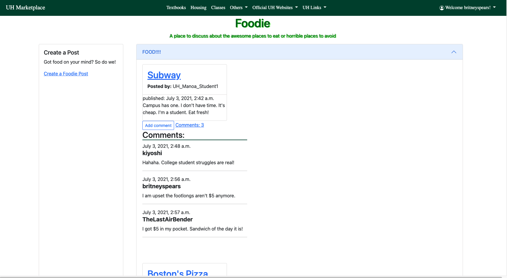

<h2> Welcome! to the UH Marketplace </h2>
For my EE491F class, our final project was to create a website using Django and Heroku. We had to form a group of five and we decided to name our team Revengers. We decided to create a website that would allow UH students to sell their textbooks and post blogs. It is inspired by Meta’s Marketplace where users can sell and auction their items.  I created a draft of the front-end page and worked on styling how the front-end page would look and the user interface. I also assisted other members if they needed help such as trying to figure out how to get the textbooks to work on the site.

<h2> Login Page </h2>
We were able to create a login page where users can store their usernames and password. So they can create a username and it would be saved if they wanted to access their account again they just need to input their password. All of their info such as textbooks auction or any blog they wrote would be controlled by them. 

<h2> BlogPost </h2>
Below is an example of a blog post a user can make. They can create a post and it would show who created it and the time it was created. Other users can also comment on the post and it too shows the time the post was created. We also have a page where users can sell or auction their textbooks and it would have things like ratings and cost. It would also have a bunch of objects for the book such as the author, name, and class it is used for. The same thing is similar to the blog post users can comment on it and request to buy it.

