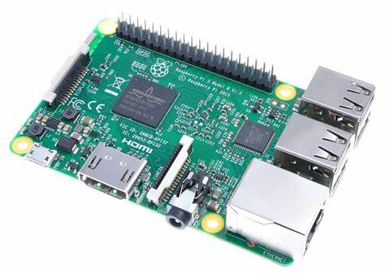
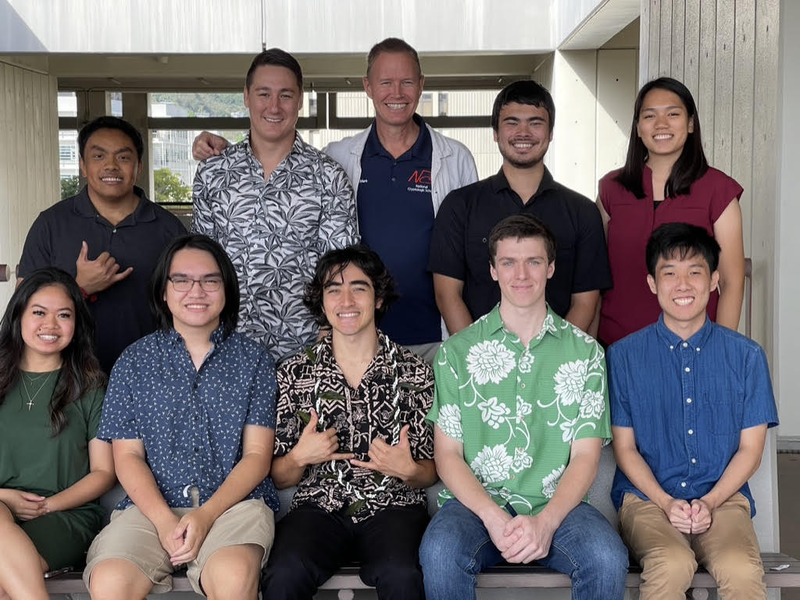

<h2> SCADA  </h2>
The UH Manoa SCADA Lab aims to create a Cybersecurity Intrusion Detection System (IDS) using a machine learning algorithm to classify network traffic as normal or abnormal, we use a Software-Defined Network (SDN) to create a custom IDS. Most of the work is done on Raspberry Pi’s. We learn and work with many things such as network ports, VLANS, and a windows active directory. Each member in the lab has their own role and mine was the Linux System Admin. However, we would collaborate and work together with other teams to get results. 

<h2> CAPSTONE Project </h2>
This was my senior project that I started in the fall of 2022 and completed in the spring of 2023. As the System Admin, it is my job to create and maintain the computers (mostly Raspberry Pi’s) in the lab. Raspberry Pi’s uses Linux Operating System (OS). Every software application installed on our Pi’s is approved or installed by me. It is also the Linux System Admin's job to constantly monitor these devices and track changes. It is the Linux Admin's job to multi-home the Pi's and set them up on their VLANs. VLANs are Virtual Local Area Networks which are subnets (Independent Broadcast Domains). In this lab, we have four VLANs. The first VLAN is the general VLAN which is where most of our Pi’s are connected, the second is the SDN controller, the third is the SEL[3] (Schweitzer Engineering Laboratories), and the fourth is the security VLAN. 

<h2> The Big Mission </h2>
During my time as the System Admin I added and maintained more Pis and set up the Windows Server. We were able to set up DHCP, DNS, and Time service such that our Raspberry Pi's could get their IP address automatically. Our DHCP Server is able to automatically issue IP addresses to new clients. We are able to reserve IP addresses for certain client devices using their MAC address, via the Windows Server. This eliminates the need to manually configure each individual Raspberry Pi and provides stability. The DNS Server is useful because instead of having the user refer to every device in the network by their assigned IP address, we are able to instead use a domain name. Our Time Server allows us tp distribute time to computers on protected networks. It is currently synced to ntp.hawaii.edu (UH Manoa's time server). We also stood up a database server using a Debian OS called Castle to collect logs.

<h3> My SCADA Team </h3>

